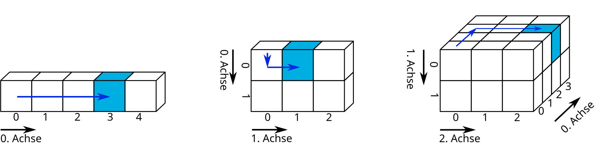
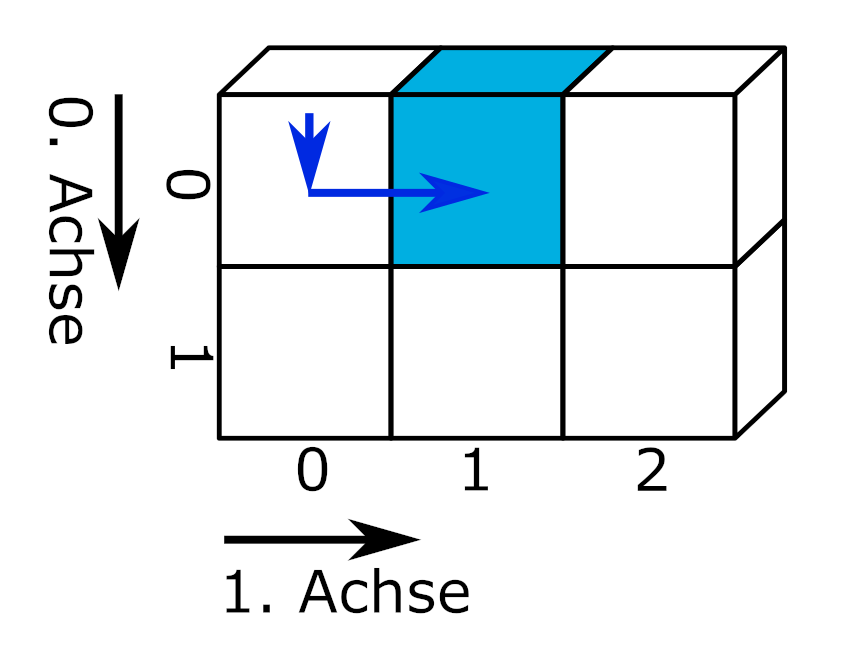

# Grundlagen: Merkmale von Datensätzen
Bevor wir uns mit den praktischen Herausforderungen des Einlesens strukturierter Datensätze beschäftigten, werden zunächst einige Merkmale von Datensätzen behandelt, um ein grundlegendes Verständnis der Begrifflichkeiten zu schaffen und den Umgang der in der Basis von Python enthaltenen Werkzeuge zu vermitteln. Am Ende dieses Kapitels wird mit tidy data ein grundlegendes Konzept zur Organisation von Datensätzen vorgestellt.

::: {#imp-Datensatz .callout-important}
## Datensatz

Ein Datensatz ist eine Sammlung zusammengehöriger Daten. Datensätze enthalten einer oder mehreren Variablen zugeordnete Werte. Jeder Datensatz besitzt ein technisches Format, eine Struktur, mindestens eine Variable und mindestens einen Wert.

:::

## Technisches Format
Das technische Format eines Datensatzes gibt vor, mit welchen Mitteln Daten eingelesen, bearbeitet und gespeichert werden können. Einige Beispiele sind:

  - Druckerzeugnis, z. B. Telefonbuch: manuelles Ablesen von Name und Telefonnummer, irreversible Bearbeitung per Stift
  
  - Lochkarte, z. B. Parkschein: Lesegerät erkennt Lochung und gewährt eine Freistunde, irreversible Bearbeitung mit Stanzgerät
  
  - Textdatei, z. B. Einwohnerzahl nach Bundesländern: Kann mit einer Vielzahl von Computerprogrammen wie Texteditor, Tabellenkalkulationsprogramm oder Programmierumgebung eingelesen, bearbeitet und gespeichert werden.
  
  - Hierarchical Data Format HDF5, z. B. räumliche Daten zur Blitzdichte: benötigt spezialisierte Programme oder Pakete

## Struktur
Datensätze speichern Daten in einer definierten n-dimensionalen Struktur.

::: {.border}
{fig-alt="Dargestellt sind von links nach rechts ein-, zwei- und dreidimensionale Blockstrukturen, die Datensätze repräsentieren. Die Teilgrafiken werden in den folgenden Abschnitten wiederverwendet und dabei auch näher beschrieben."}

slicing von Marc Fehr ist lizensiert unter [CC-BY-4.0](https://github.com/bausteine-der-datenanalyse/w-python-numpy-grundlagen#CC-BY-4.0-1-ov-file) und abrufbar auf [GitHub](https://github.com/bausteine-der-datenanalyse/w-python-numpy-grundlagen). 2024
:::

### Eindimensionale Datensätze
Die einfachste Form sind eindimensionale Datensätze, die Werte einer einzigen Variablen zuordnen. Eindimensionale Datensätze mit Werten des gleichen Typs (bspw. Zahlen) werden **Vektor** genannt. Eindimensionale Datensätze, die unterschiedliche Datentypen enthalten können, heißen **Liste**. Eindimensionale Datensätze verfügen lediglich über eine Achse: den Index, über den Elemente angesprochen werden können.

::: {.border}

{width="50%" fig-alt="Dargestellt ist ein in fünf Blöcke unterteilter Streifen, der einen eindimensionalen Datensatz repräsentiert. Die Blöcke sind entlang der 0. Achse von links nach rechts mit 0 bis 4 beschriftet. Von Block Null aus geht ein blauer Pfeil zu Block drei, der blau markiert ist."}

slicing von Marc Fehr ist lizensiert unter [CC-BY-4.0](https://github.com/bausteine-der-datenanalyse/w-python-numpy-grundlagen#CC-BY-4.0-1-ov-file) und abrufbar auf [GitHub](https://github.com/bausteine-der-datenanalyse/w-python-numpy-grundlagen). Die Grafik wurde auf den gezeigten Teil beschnitten und die obenstehende Beschriftung entfernt. 2024
:::

&nbsp;

Beispiele eindimensionaler Datensätze sind ein Einkaufszettel oder die Urliste eines Würfelexperiments. Über den Index kann beispielsweise das Würfelergebnis an der Indexposition 2 ausgegeben werden.

``` {python}
print( *( Augen := [6, 2, 1, 2] ) )

print(f"Das Würfelergebnis an Indexposition 2 lautet: {Augen[2]}")
```


### Eindimensionale Daten einlesen mit Python
An dieser Stelle eine kleine Wiederholung aus dem [Werkzeugbaustein Python](https://bausteine-der-datenanalyse.github.io/w-python/output/book/):  
Die Pythonbasis greift über Dateiobjekte auf Dateien zu. Die Funktionen und Methoden haben Sie im Werkzeugbaustein Python kennengelernt. Der Zugriff auf Dateien über die Pythonbasis ist eine verlässliche Rückfalloption und darüber hinaus nützlich, um die Enkodierung einer Datei zu bestimmen.

::: {#tip-openundco .callout-tip collapse="false"}
## Kleine Wiederholung: Funktionen und Methoden der Pythonbasis

- Die Funktion `os.getcwd()` aus dem Modul os gibt das aktuelle Arbeitsverzeichnis aus, mit der Funktion `os.cwd(pfad)` kann es gewechselt werden.
- Die Funktion `open(dateipfad, mode = 'r')` öffnet eine Datei im Lesemodus und gibt ein Dateiobjekt zurück.
- Informationen zum Dateiobjekt können durch Ausgabe verschiedener Attribute abgerufen werden: `dateiobjekt.name`, `os.path.basename(dateiobjekt.name)`, `dateiobjekt.closed`, `dateiobjekt.mode`, `dateiobjekt.encoding` 
- Das Dateiobjekt kann mit Methoden wie `dateiobjekt.read()`, `dateiobjekt.readline()`, `dateiobjekt.readlines()` oder der Funktion `list(dateiobjekt)` ausgelesen werden.
- Die Methode `dateiobjekt.close()` schließt die Datei und gibt sie somit wieder für andere Programme frei.

:::

**Lesen Sie die Datei "python.txt" unter dem dateipfad "skript/01-daten/" ein.**

 - Bestimmen Sie die Enkodierung der Datei.

 - Entfernen Sie die die erste Zeile aus dem Text und geben Sie den Text mit Python aus.

 - Wie kann der Text korrekt dargestellt werden?

::: {#tip-pythonbasis .callout-tip collapse="true"}
## Musterlösung python.txt
```{python}
dateipfad = "01-daten/" + "python.txt"
dateiobjekt = open(dateipfad, mode = 'r')

# Enkodierung der Datei bestimmen
print(f"Die Enkodierung der Datei lautet: {dateiobjekt.encoding}")

# Text ausgeben
text_als_liste = list(dateiobjekt)

for i in range(1, len(text_als_liste)):
  print(text_als_liste[i])

# Datei schließen.
dateiobjekt.close()

```

Enkodierung UTF-8 auswählen.
```{python}

# Mit europäischen Sonderzeichen kompatible Enkodierung UTF-8 wählen
dateiobjekt = open(dateipfad, mode = 'r', encoding = 'utf-8')

# Text ausgeben
text_als_liste = list(dateiobjekt)

for i in range(1, len(text_als_liste)):
  print(text_als_liste[i])

# Datei schließen.
dateiobjekt.close()

```

:::

### Zweidimensionale Datensätze
Zweidimensionale Datensätze organisieren Werte in einer aus Zeilen und Spalten bestehenden **Matrix** oder einem **Dataframe**. Eine Matrix enthält nur einen Datentyp (bspw. Zahlen), ein Dataframe kann unterschiedliche Datentypen enthalten (bspw. Zahlen und Wahrheitswerte). In Python stellt das Modul Pandas die DataFrame-Struktur bereit (siehe [Werkzeugbaustein Pandas](https://bausteine-der-datenanalyse.github.io/w-pandas/output/book/)).

::: {.border}
{width="45%" fig-alt="Dargestellt ist ein zweidimensionaler Block, der einen zweidimensionalen Datensatz repräsentiert. Pfeile repräsentieren die zwei Achsen. Die nullte Achse entspricht der Länge (von oben nach unten) und die erste Achse der Breite des Datensatzes."}

slicing von Marc Fehr ist lizensiert unter [CC-BY-4.0](https://github.com/bausteine-der-datenanalyse/w-python-numpy-grundlagen#CC-BY-4.0-1-ov-file) und abrufbar auf [GitHub](https://github.com/bausteine-der-datenanalyse/w-python-numpy-grundlagen). Die Grafik wurde auf den gezeigten Teil beschnitten und die obenstehende Beschriftung entfernt. 2024
:::

&nbsp;

Typischerweise entspricht in zweidimensionalen Datensätzen jede Spalte einer **Variablen** und jede Zeile einer **Beobachtung**. Variablen speichern alle Werte eines Merkmals, zum Beispiel des Würfelergebnisses. Beobachtungen speichern alle Werte, die für eine Beobachtungseinheit gemessen wurden, z. B. für eine Person. [@Wickham-2014, S. 3]

``` {python}
import pandas as pd

messung1 = pd.DataFrame({'Name': ['Hans', 'Elke', 'Jean', 'Maya'], 'Geburtstag': ['26.02.', '14.03.', '30.12.', '07.09.'], 'Würfelfarbe': ['rosa', 'rosa', 'blau', 'gelb'], 'Summe Augen': [17, 12, 8, 23]})

messung1
```

&nbsp;

Über die Angabe der Indizes entlang der 0. (Zeilen) und der 1. Achse (Spalten) kann die Summe der gewürfelten Augen einer Person ausgegeben werden. 

``` {python}

print(f"Jean würfelte {messung1.iloc[2, 3]} Augen")
```

Es ist aber auch möglich, zunächst eine Spalte auszuwählen und dann wie bei einem eindimensionalen Datensatz den Wert an einer Indexposition aufzurufen. Dies wird verkettete Indexierung genannt.

``` {python}

print(f"Jean würfelte {messung1['Summe Augen'][2]} Augen")
```

::: {#wrn-chainedassignment .callout-warning appearance="simple"}
## Verkettete Indexierung

Die verkettete Indexierung erzeugt in Pandas abhängig vom Kontext eine Kopie des Objekts oder greift auf den Speicherbereich des Objekts zu. Mit Pandas 3.0 wird die verkettete Indexierung nicht mehr unterstützt, das Anlegen einer Kopie wird zum Standard werden. Weitere Informationen erhalten Sie im zitierten Link.

:::: {.border layout="[5, 90, 5]"}

&nbsp;

"Whether a copy or a reference is returned for a setting operation, may depend on the context. This is sometimes called `chained assignment` and should be avoided. See [Returning a View versus Copy](https://pandas.pydata.org/docs/user_guide/indexing.html#indexing-view-versus-copy)."

&nbsp;

::::

([Pandas Dokumentation](https://pandas.pydata.org/docs/user_guide/indexing.html))
:::

### long- und wide-Format
Zweidimensionale Datensätze werden zumeist in einer aus Zeilen und Spalten bestehenden Matrix dargestellt. Den zeilenweise eingetragenen Beobachtungen werden Werte für die in den Spalten organisierten Variablen zugeordnet. Diese Art Daten darzustellen, wird wide-Format genannt: Mit jeder zusätzlich gemessenen Variablen wird der Datensatz breiter.

Eine andere Art Daten zu organisieren und über Daten nachzudenken, ist die Darstellung im long-Format. Einige Programme und Pakete erfordern Daten im long-Format oder profitieren zumindest davon beispielsweise bei der Erstellung von Grafiken. Schauen wir uns zunächst noch einmal den Datensatz messung1 im wide-Format an. Welche Beobachtungseinheiten gibt es? Welche Variablen wurden erhoben?

``` {python}
#| echo: false

messung1
```

&nbsp;

Vermutlich werden Sie davon ausgehen, dass die Beobachtungseinheiten Hans, Elke, Jean und Maya sind und die Variablen Geburtstag, Würfelfarbe und Summe Augen. Es ist aber auch denkbar, dass die Beobachtungseinheit Person mit 0, 1, 2 und 3 kodiert wurde (dem Zeilenindex des Datensatzes) und die Spalte Name ebenfalls eine der erhobenen Variablen ist. Ebenso könnte es nur zwei Variablen, Würfelfarbe und Summe Augen, geben, während die Spalten Name und Geburtstag die beobachteten Personen kodieren. Stellen Sie sich vor, es gäbe eine zweite Person mit dem Namen Hans. Dann könnten die Würfelergebnisse der Personen mit dem Namen Hans nur über den Geburtstag am 26.02. oder 11.11. korrekt zugeordnet werden.

``` {python}
messung1 = pd.DataFrame({'Name': ['Hans', 'Elke', 'Jean', 'Maya', 'Hans'], 'Geburtstag': ['26.02.', '14.03.', '30.12.', '07.09.', '11.11.'], 'Würfelfarbe': ['rosa', 'rosa', 'blau', 'gelb', 'rosa'], 'Summe Augen': [12, 17, 8, 23, 7]})

messung1
```

&nbsp;

Das long-Format macht diese Überlegungen explizit, indem identifizierende Variablen (identification variables, kurz: id vars) und gemessene Variablen (measure variables oder value vars) unterschieden werden. Die Transformation eines Datensatzes aus dem wide-Format ins long-Format wird melting (schmelzen) genannt. Das Modul Pandas bietet die Funktion `pd.melt(frame, id_vars = None)`. Diese erwartet einen DataFrame. Im optionalen Argument `id_vars` wird angegeben, welche Spalten die identifizierenden Variablen sind.

``` {python}

messung1_long = pd.melt(messung1, id_vars = ['Name', 'Geburtstag'])

messung1_long
```

&nbsp;

Im long-Format werden die gemessenen Variablen in der Spalte variable aufgeführt und deren Wert in der Spalte value eingetragen. Mit jeder zusätzlich erhobenen Variablen wird der Datensatz länger.

Wenn Sie die Unterscheidung von identifizierenden und gemessenen Variablen zu Ende denken, kann der Variablenname selbst als eine identifizierende Variable für den Wert in der Spalte value aufgefasst werden. Ein Datensatz kann als eine Struktur verstanden werden, die genau eine gemessene Variable, nämlich value, und eine Anzahl identifizierender Variablen besitzt. Dies kann im long-Format wie folgt dargestellt werden.

``` {python}
#| output: false

messung1_all_id = pd.melt(messung1, id_vars = ['Name', 'Geburtstag', 'Würfelfarbe'])

messung1_all_id

```

In dieser Darstellung wird beispielsweise der erste Wert 12 durch Name = Hans, Geburtstag = 26.02., Würfelfarbe = rosa und variable = Summe Augen identifiziert.


::: {layout="[70, 30]"}
``` {python}
#| echo: false

messung1_all_id = pd.melt(messung1, id_vars = ['Name', 'Geburtstag', 'Würfelfarbe'])

messung1_all_id

```

{width="90%" fig-alt="dekoratives Bild eines staunenden Hundes"} 

::: 

::: {.border}
Much wow. Such architecture. von Dmitry Kudryavtsev ist verfügbar unter <https://yieldcode.blog/post/bloat-in-software-engineering/>.
:::

**Was passiert, wenn auch die Variable `Summe Augen` dem Argument `id_vars` übergeben wird?**

::: {#tip-Antwort-all-id .callout-tip collapse="true"}
## Antwort

Der Befehl `messung1_all_id = pd.melt(messung1, id_vars = ['Name', 'Geburtstag', 'Würfelfarbe', 'Summe Augen'])` produziert einen leeren Dataframe, weil keine gemessenen Werte verbleiben.
:::

Auch der umgekehrte Fall ist möglich: Werden beim melting keine id_vars angegeben, werden alle Spalten als gemessene Variablen behandelt.

``` {python}

messung1_no_id = pd.melt(messung1)

messung1_no_id

```

&nbsp;

Die Umkehroperation zum melting wird casting (gießen) oder pivoting (schwenken) genannt. Dabei wird ein im long-Format vorliegender Datensatz in das wide-Format konvertiert. Die Pandas Funktion `pd.pivot(data, columns, index)` nimmt einen melted DataFrame entgegen und konveriert diesen aus den einzigartigen Werten in columns (= Spaltennamen des DataFrame im wide-Format) und den einzigartigen Werten in index (= Zeilenindex des DataFrame im wide-Format). Wird der Funktion keine Spalte für index übergeben, wird der bestehende Index des melted DataFrame verwendet (der mit 20 Zeilen natürlich viel zu lang ist.) Da das Objekt messung1_no_id keine geeignete Indexspalte besitzt, muss diese vor dem casting erzeugt werden. Dies ist mit der Methode `messung1_no_id.groupby('variable').cumcount()` möglich, die die Anzahl jeder Ausprägung in der übergebenen Spalte bei 0 beginnend durchzählt. (Ein direktes Ersetzen des Index ist auf diese Weise nicht möglich, da der Index des an `pd.pivot(data, columns, index)` übergebenen DataFrames keine Doppelungen enthalten darf.)

``` {python}
# pd.pivot() benötigt einen Index oder benutzt den bestehenden Index, des melted_df, der zu lang ist
# Deshalb eine zusätzliche Spalte in messung1_no_id einfügen
## einfach: messung1_no_id['new_index'] = list(range(0, 5)) * 4 
## allgemein: messung1_no_id['new_index'] = messung1_no_id.groupby('variable').cumcount()

# Spalte new_index einfügen
messung1_no_id['new_index'] = messung1_no_id.groupby('variable').cumcount()
print (f"Der Datensatz im long-Format mit zusätzlicher Spalte new_index:\n{messung1_no_id}")

# casting
messung1_cast = pd.pivot(messung1_no_id, index = 'new_index', columns = 'variable', values = 'value')
print(f"\nDer Datensatz im wide-Format:\n{messung1_cast}")
```

Das Ergebnis entspricht noch nicht dem ursprünglichen Datensatz im wide-Format. Um das Ausgangsformat wiederherzustellen, müssen die Spalten in die ursprüngliche Reihenfolge gebracht sowie der Index und dessen Beschriftung zurückgesetzt werden.

```{python}

# Spalten anordnen, Index zurücksetzen
messung1_cast = messung1_cast[['Name', 'Geburtstag', 'Würfelfarbe', 'Summe Augen']]
messung1_cast.reset_index(drop = True, inplace = True)
messung1_cast.rename_axis(None, axis = 1, inplace = True)

print(f"\nDer Datensatz im wide-Format mit zurückgesetztem Index:\n\n{messung1_cast}")

```

::: {#tip-idvars .callout-tip collapse="false"}
## identifizierende und gemessene Variablen

Auch wenn Sie mit Datensätzen im wide-Format arbeiten, ist die Unterscheidung identifizierender und gemessener Variablen nützlich, um Datensätze zu organisieren. [siehe @sec-tidydata]

:::

### Übung zweidimensionale Datensätze
Oben wurde das Objekt messung1_long mit dem Befehl `messung1_long = pd.melt(messung1, id_vars = ['Name', 'Geburtstag'])` angelegt.  
**Benutzen Sie die Funktion** `pd.DataFrame.pivot()`, **um den Datensatz messung1 wieder ins wide-Format zu transformieren.**

``` {python}
#| echo: false

messung1_long
```


::: {#tip-pivoting .callout-tip collapse="true"}
## Musterlösung zweidimensionale Datensätze

``` {python}

# Spalte new_index einfügen
messung1_long['new_index'] = messung1_long.groupby('variable').cumcount()

# casting
messung1_long_cast = pd.pivot(messung1_long, index = 'new_index', columns = 'variable', values = 'value')

# Spalten anordnen, Index zurücksetzen
messung1_long_cast = messung1_cast[['Name', 'Geburtstag', 'Würfelfarbe', 'Summe Augen']]
messung1_long_cast.reset_index(drop = True, inplace = True)
messung1_long_cast.rename_axis(None, axis = 1, inplace = True)

messung1_long_cast

```


:::

### Drei- und mehrdimensionale Datensätze
Drei- oder mehrdimensionale Datensätze organisieren komplexe Datenstrukturen in sogenannten **Arrays**. Arrays sind n-dimensionale Datenstrukturen und damit zugleich ein Oberbegriff. So ist eine Liste ein eindimensionales Array, eine Matrix ein zweidimensionales Array und eine Excel-Datei mit mehreren Arbeitsblättern für jährlich erhobene Umfragedaten ein 3-dimensionales Array (Arbeitsblätter, Zeilen, Spalten). Abhängig vom verwendeten Modul können Arrays ein oder mehrere Datentypen enthalten.

<!-- ggf. ergänzen: Modul xarray <https://docs.xarray.dev/en/stable/user-guide/pandas.html> -->

::: {.border}
{width="50%" fig-alt="Dargestellt ist ein dreidimensionaler Block, der einen dreidimensionalen Datensatz repräsentiert. Pfeile repräsentieren die drei Achsen. Die nullte Achse entspricht der Tiefe, die erste Achse der Länge (von oben nach unten) und die zweite Achse der Breite des Datensatzes."}

slicing von Marc Fehr ist lizensiert unter [CC-BY-4.0](https://github.com/bausteine-der-datenanalyse/w-python-numpy-grundlagen#CC-BY-4.0-1-ov-file) und abrufbar auf [GitHub](https://github.com/bausteine-der-datenanalyse/w-python-numpy-grundlagen). Die Grafik wurde auf den gezeigten Teil beschnitten und die obenstehende Beschriftung entfernt. 2024

:::

&nbsp;

Für drei- und mehrdimensionale Datenstrukturen werden häufig spezialisierte Datenformate verwendet, die im Abschnitt @sec-spezialformate behandelt werden. Dies hat unter anderem den Grund, dass so leichter verschiedene Datentypen verarbeitet und mit Metadaten (siehe @sec-metadaten) dokumentiert werden können.

#### Bilddaten einlesen

::: {.border}
Digitale Bilder liegen in Form eines dreidimensionalen Datensatzes vor. In Zeilen und Spalten liegen für jeden Pixel Farbwerte (Rot, Grün, Blau) und gegebenenfalls ein Alphawert vor (Rot, Grün, Blau, Alpha). Die Farbwerte liegen entweder im Bereich von 0 bis 1 oder von 0 bis 255 (8-Bit).

```
# Farbwerte für einen Pixel
[Rotwert, Grünwert, Blauwert]

# Eine Bildzeile mit drei Pixeln
[[Rotwert, Grünwert, Blauwert], [Rotwert, Grünwert, Blauwert], [Rotwert, Grünwert, Blauwert]]

# Ein Bild aus drei Zeilen und Spalten
[[[Rotwert, Grünwert, Blauwert], [Rotwert, Grünwert, Blauwert], [Rotwert, Grünwert, Blauwert]],
[[Rotwert, Grünwert, Blauwert], [Rotwert, Grünwert, Blauwert], [Rotwert, Grünwert, Blauwert]],
[[Rotwert, Grünwert, Blauwert], [Rotwert, Grünwert, Blauwert], [Rotwert, Grünwert, Blauwert]]]
```

Bilddateien können mit der Funktion `plt.imread()` aus dem Modul `matplotlib.pyplot` eingelesen werden. 

:::: {.border}
``` {python}
import matplotlib.pyplot as plt

logo = plt.imread(fname = '00-bilder/python-logo-and-wordmark-cc0-tm.png')

plt.imshow(logo)

```

Python Logo von Python Software Foundation steht unter der [GPLv3](https://www.gnu.org/licenses/gpl-3.0.html). Die Wort-Bild-Marke ist markenrechtlich geschützt: <https://www.python.org/psf/trademarks/>. Das Werk ist abrufbar auf [wikimedia](https://de.m.wikipedia.org/wiki/Datei:Python_logo_and_wordmark.svg). 2008

:::: 

&nbsp;

Die Struktur des Datensatzes kann mit dem Attribut `.shape` abgerufen werden.

``` {python}
print(type(logo), "\n")

print(logo.shape)

```

Die Daten wurden als NumPy.ndarray eingelesen. Das Logo hat 144 Zeilen, 486 Spalten und liegt im RGBA-Farbraum vor. Ein Ausschnitt der Daten sieht so aus:

``` {python}
print(logo[50:52, 50:52, : ])

```

[@Arnold-2023-numpy-dateien]

:::

### Übung dreidimensionale Datensätze
Über den Index der dritten Dimension können die Farbkanäle Rot, Grün und Blau ausgewählt und mit der Funktion `plt.imshow(cmap = 'Greys_r')` einzeln dargestellt werden. Das Argument `cmap = 'Greys_r'` weist die Funktion an, die invertierte Grauskala benutzen. Dadurch werden hohe Farbwerte hell und niedrige Farbwerte dunkel dargestellt. **Stellen Sie die Farbkanäle Rot, Grün und Blau des Pythonlogos einzeln mit der Funktion `plt.imshow(cmap = 'Greys_r')` dar.**

::: {#tip-logo .callout-tip collapse="true"}
## Musterlösung dreidimensionale Datensätze
``` {python}
#| fig-cap: Farbkanäle des Pythonlogos
#| fig-alt: "Dargestellt sind die drei Farbkanäle des Pythonlogos."

kanal = ["Rotkanal", "Grünkanal", "Blaukanal"]

plt.figure(figsize = (9, 6))

for i in range(3):

  plt.subplot(1, 4, i + 1)
  plt.imshow(logo[ :, :, i], cmap = 'Greys_r')
  plt.title(label = kanal[i])

plt.colorbar(shrink = 0.15)

plt.tight_layout()
plt.show()

```

Möglicherweise wundern Sie sich, warum der Bildhintergrund in jedem Farbkanal schwarz ist. Die Ursache finden Sie im nächsten Tipp.

:::: {#tip-logo .callout-tip collapse="true"}
## Erklärung Bildhintergrund
Der Bildhintergrund hat in allen Kanälen, auch im Alphakanal, den Farbwert 0. Dieser Teil des Bildes ist deshalb vollständig transparent und wird vom Hintergrund der Internetseite ausgefüllt. Der Bildhintergrund des Logos wirkt deshalb weiß.

``` {python}
#| fig-cap: Alphakanal des Pythonlogos
#| fig-alt: "Dargestellt ist der Alphakanal des Pythonlogos. Der Bildhintergrund hat den Farbwert 0."

# Alphakanal
plt.imshow(logo[ :, :, 3], cmap = 'Greys_r')
plt.title(label = 'Alphakanal')
plt.colorbar(shrink = 0.4)

plt.show()

# Die ersten zwei Zeilen und Spalten des Logos
print(logo[0:2, 0:2, : ])
```

::::
:::

## Datentyp {#sec-datentyp}
Der Datentyp gibt an, wie die in einem Datensatz einhaltenen Werte von Python interpretiert werden sollen. Beispielsweise kann der Wert "1" ein Zeichen, eine Ganzzahl, einen Wahrheitswert, den Monat Januar oder die Ausprägung einer kategorialen Variablen repräsentieren. Python unterstützt als vielseitig einsetzbare Programmiersprache zahlreiche Datentypen, die den Kategorien: numerics, sequences, mappings, classes, instances and exceptions zugeordnet sind. Nähere Informationen dazu finden Sie in der [Dokumentation](https://docs.python.org/3/library/stdtypes.html).

::: {.border}
{width="60%" fig-alt="Dargestellt ist eine Kategorisierung der Standardtypen in Python. Die Kategorisierung ist nicht vollständig deckungsgleich zu den in der Dokumentation genannten Kategorien von Datentypen. Der Typ None für Nullwerte hat keine weitere Unterteilung. Die Kategorie Numbers unterteilt sich in Zahlenwerte (Ganzzahlen, boolsche Wahrheitswerte), reele Zahlen (floats) und komplexe Zahlen. Die Kategorie Sequences unterteilt sich in Unveränderliche (Strings, Tuple, Bytes) und Veränderliche (Listen, Byte Arrays). Die Kategorie Set Types unterteilt sich in Sets (Mengen) und Frozen Sets. Die Kategorie Mappings enthält Dictionaries (Wörterbücher). Die Kategorie Callable umfasst Funktionen, Methoden und Klassen. Außerdem gibt es die Kategorie Module."}

Python 3. The standard type hierarchy. von Максим Пе ist lizensiert unter [CC BY SA 4.0](https://creativecommons.org/licenses/by-sa/4.0/deed.de) und abrufbar auf [wikimedia](https://commons.wikimedia.org/wiki/File:Python_3._The_standard_type_hierarchy.png). 2018
:::

&nbsp;

Durch Module werden weitere Datentypen hinzugefügt. In der Datenanalyse häufig verwendete Datentypen sind:

  - Zahlen: Ganzzahl, Fließkommazahlen

  - Wahrheitswerte

  - Zeichenketten

  - Datums- und Uhrzeitangaben

  - Kategorie<!-- Faktor in R--> (aus dem Modul [Pandas](https://pandas.pydata.org/docs/user_guide/categorical.html))

Der Datentyp bestimmt zum einen den zulässigen Wertebereich einer Variablen. Beispielsweise sind 0 und 13 zulässige Ganzzahlen, aber keine gültigen Kodierungen des Monats. Zum anderen definiert der Datentyp, welche Operationen mit den Werten zulässig sind und wie diese von Python ausgeführt werden. Dies betrifft Operatoren und Funktionen. Python enthält Funktionen, um den Datentyp eines Werts zu bestimmen und ggf. umzuwandeln (siehe w-Python).

::: {#nte-operation-nach-datentyp .callout-note}
