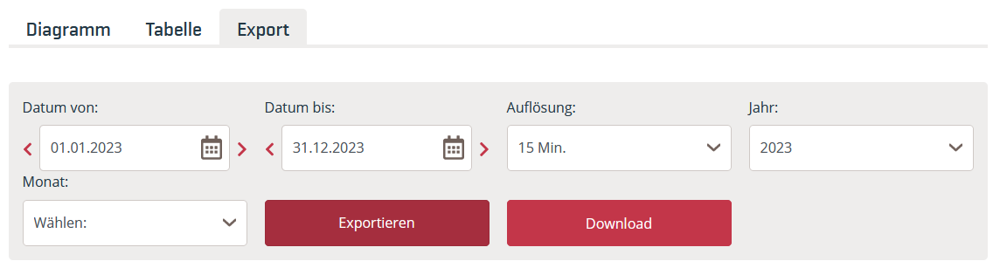

# Markttransparenzdaten Österreich herunterladen

``` {python}
# Vorbereitung: Module aus vorherigem Kapitel erneut laden
import numpy as np
import pandas as pd
```

Nach der Auswahl des Zeitraums auf Exportieren klicken, dann erscheint die Schaltfläche Download. 

{fig-alt="Ansicht der Eingabefelder, um die österreichischen Strommarktdaten herunterzuladen."}

{fig-alt="Ansicht der Eingabefelder, um die österreichischen Strommarktdaten in englischer Sprache herunterzuladen."}

Das Datumsformat der Dateien ist abhängig von der auf der Internetseite eingestellten Sprache (Deutsch/English).

:::

&nbsp;

Diesem Skript ist folgende Datei angefügt. 

::: {style="font-size: 90%;"}
| Daten | Dateiname |
|---|---|
| Realisierte Stromerzeugung 2023 | AGPT_2022-12-31T23_00_00Z_2023-12-31T23_00_00Z_15M_de_2024-06-10T09_32_38Z.csv |
:::

In dem Datensatz wird durch die Umstellung von Sommer- auf Winterzeit am letzten Sonntag im Oktober die Stunde 2 Uhr morgens doppelt eingetragen (dafür fehlt eine Stunde bei der Umstellung von Winter- auf Sommerzeit am letzten Sonntag im März). Die doppelte Stunde wird im Datensatz mit 2A bzw. 2B gekennzeichnet. (Mitteilung Austrian Power Grid AG vom 13.08.2024)

{fig-alt="Dargestellt ist ein Ausschnitt aus dem Datensatz der österreichischen Erzeugungsdaten. In den Spalten Zeit von [CET/CEST] und Zeit bis [CET/CEST] ist der Zeitraum vom 29.10.2023 02:00:00 bis 29.10.2023 03:00:00 gelb markiert, um die im vorausgehenden Text beschriebene Auffälligkeit zu illustrieren."}

**Lesen Sie die Datei so ein, dass die Spalten mit Datums- und Zeitinformationen als datetime erkannt werden. Lösen Sie die Zeitumstellung so auf, dass jeder Tag 24 Stunden hat.**

::: {#tip-Austria title="Musterlösung Strommarktdaten Österreich" .callout-tip collapse="true"}

:::: {.callout-tip collapse="true"}
## einfache Variante

Die einfachste Lösung ist es, Zeitreihen zu generieren und die Spalten 'Zeit von [CET/CEST]' und 'Zeit bis [CET/CEST]' damit zu ersetzen.
```
von = pd.date_range(start = "2023-01-01T00:00", end = "2023-12-31T23:45", freq = '15min')
bis = pd.date_range(start = "2023-01-01T00:15", end = "2024-01-01T00:00", freq = '15min')

print(von[8070:8078], "\n")
print(bis[8070:8078], "\n")
```
::::

**Datei einlesen und String-Manipulation**

Zunächst wird die Datei eingelesen. Die Zellen, die sich nicht in datetime umwandeln lassen, können mit Python ausgegeben werden.

``` {python}
# Datei einlesen
erzeugung_austria = pd.read_csv(filepath_or_buffer = "01-daten/AGPT_2022-12-31T23_00_00Z_2023-12-31T23_00_00Z_15M_de_2024-06-10T09_32_38Z.csv",
                                sep = ";", decimal = ",", thousands = ".")

# Zellen mit fehlerhaften datetime strings identifizieren
print("Spalte 'Zeit von [CET/CEST]'")
i = 0
position_element = []
for element in erzeugung_austria['Zeit von [CET/CEST]']:
  try:
    pd.to_datetime(element, format = "%d.%m.%Y %H:%M:%S")
  except:
    print(element)
    position_element.append(i)
  i += 1
print("\nDie Zellen haben den Zeilenindex: ", position_element, "\n")

print("Spalte 'Zeit bis [CET/CEST]'")
i = 0
position_element = []
for element in erzeugung_austria['Zeit bis [CET/CEST]']:
  try:
    pd.to_datetime(element, format = "%d.%m.%Y %H:%M:%S")
  except:
    print(element)
    position_element.append(i)
  i += 1
print("\nDie Zellen haben den Zeilenindex: ", position_element, "\n")
```

Damit die Datumsspalten korrekt eingelesen werden können, werden die Zeichenfolgen "2A" und "2B" mit der Methode `str.replace()` durch "02" ersetzt. Dadurch wird eine Dublette im Datensatz erzeugt.

``` {python}
# string replace & als Datum einlesen
## Spalte Zeit von [CET/CEST]
erzeugung_austria['Zeit von [CET/CEST]'] = erzeugung_austria['Zeit von [CET/CEST]'].str.replace(pat = '2A', repl = '02')
erzeugung_austria['Zeit von [CET/CEST]'] = erzeugung_austria['Zeit von [CET/CEST]'].str.replace(pat = '2B', repl = '02')

erzeugung_austria['Zeit von [CET/CEST]'] = pd.to_datetime(erzeugung_austria['Zeit von [CET/CEST]'], format = "%d.%m.%Y %H:%M:%S")

## Spalte Zeit bis [CET/CEST]
erzeugung_austria['Zeit bis [CET/CEST]'] = erzeugung_austria['Zeit bis [CET/CEST]'].str.replace(pat = '2A', repl = '02')
erzeugung_austria['Zeit bis [CET/CEST]'] = erzeugung_austria['Zeit bis [CET/CEST]'].str.replace(pat = '2B', repl = '02')

erzeugung_austria['Zeit bis [CET/CEST]'] = pd.to_datetime(erzeugung_austria['Zeit bis [CET/CEST]'], format = "%d.%m.%Y %H:%M:%S")

print(erzeugung_austria.info())

```

**Indexpositionen der doppelten und der fehlenden Stunde bestimmen**

Im nächsten Schritt werden die Indexposition der doppelten und der fehlenden Stunde bestimmt. Dazu wird ein neues Objekt angelegt, das auf den Speicherbereich der Datumsspalten zugreift (was nicht zwingend erforderlich ist). Die Position der doppelten Stunde wird mit der Methode `pd.Series.duplicated()` bestimmt, die einen logischen Vektor zurückgibt. Dieser wird zum Slicing und der Ausgabe der Indexposition verwendet. Durch die Subtraktion von 4 wird der Index der ersten Stunde ausgegeben (der Datensatz ist auf Viertelstundenbasis).

*doppelte Stunde*

``` {python}
# neues Objekt anlegen
austria_dates = erzeugung_austria[['Zeit von [CET/CEST]', 'Zeit bis [CET/CEST]']].copy()

# Indexposition der doppelten Stunde bestimmen
## Zeit von
position_doppelte_stunde_von = austria_dates['Zeit von [CET/CEST]'][austria_dates['Zeit von [CET/CEST]'].duplicated()].index - 4

print(f"Die doppelte Stunde (Zeit von):\n{austria_dates.loc[position_doppelte_stunde_von, 'Zeit von [CET/CEST]']}\nsteht an Indexposition\n {position_doppelte_stunde_von}\n"
f"\nDie nächste Stunde lautet:\n{austria_dates.loc[position_doppelte_stunde_von + 4, 'Zeit von [CET/CEST]']}"
f"\n\nBeide Stunden sind identisch.")

### Ende der Verschiebung in Spalte Zeit von
ende_verschiebung_von = position_doppelte_stunde_von[-1]
print(f"\nDie Zeitverschiebung in der Spalte Zeit von endet bei Indexposition: {ende_verschiebung_von}")

## Zeit bis
position_doppelte_stunde_bis = austria_dates['Zeit bis [CET/CEST]'][austria_dates['Zeit bis [CET/CEST]'].duplicated()].index - 4

print(f"\n\nDie doppelte Stunde (Zeit bis):\n{austria_dates.loc[position_doppelte_stunde_bis, 'Zeit bis [CET/CEST]']}\nsteht an Indexposition\n {position_doppelte_stunde_bis}\n"
f"\nDie nächste Stunde lautet:\n{austria_dates.loc[position_doppelte_stunde_bis + 4, 'Zeit bis [CET/CEST]']}"
f"\n\nBeide Stunden sind identisch.")

### Ende der Verschiebung in Spalte Zeit bis
ende_verschiebung_bis = position_doppelte_stunde_bis[-1]
print(f"\nDie Zeitverschiebung in der Spalte Zeit bis endet bei Indexposition: {ende_verschiebung_bis}")
```

*fehlende Stunde* 

Die Sommerzeit beginnt am letzten Sonntag im März. Die Stunde liegt nicht in range(0, 24). Diese Bedingung kann in vier Schritten kontrolliert werden:

  - Monat März: `march = pd.Series[pd.Series.dt.month == 3]`

  - Sonntage im März: `sundays = march[march.dt.dayofweek == 6]`

  - letzter Sonntag im März: Die letzten 23*4 Einträge sind der letzte Sonntag des Monats (23 weil eine Stunde fehlt).  
  `last_sunday = sundays[-23*4:]`
  
  - fehlende Stunde: `np.argwhere(np.invert(pd.Series(range(0,24)).isin(last_sunday.dt.hour)))`

``` {python}
# Indexposition der fehlenden Stunde bestimmen
## Zeit von
### Monat März
maske_märz_von = austria_dates['Zeit von [CET/CEST]'].dt.month == 3
austria_dates_march_von = austria_dates.loc[maske_märz_von, 'Zeit von [CET/CEST]']
print(f"Der Monat März (Zeit von):\n{austria_dates_march_von.head}\n");

### letzter Sonntag
maske_sonntag_von = (austria_dates_march_von.dt.dayofweek == 6)
letzter_sonntag_von = (austria_dates_march_von[maske_sonntag_von]) [-23*4 :]
print(f"Der letzte Sonntag im März:\n{letzter_sonntag_von}\n")

### fehlende Stunde
print(letzter_sonntag_von.dt.hour)
fehlende_stunde_von = np.argwhere(np.invert(pd.Series(range(0,24)).isin(letzter_sonntag_von.dt.hour))).item() 
print(f"\nEs fehlt die Stunde:\n{fehlende_stunde_von}\n")
print(letzter_sonntag_von[letzter_sonntag_von.dt.hour == (fehlende_stunde_von - 1)], letzter_sonntag_von[letzter_sonntag_von.dt.hour == (fehlende_stunde_von + 1)], sep = "\n")

### Beginn der Verschiebung in Spalte Zeit von
beginn_verschiebung_von = letzter_sonntag_von[letzter_sonntag_von.dt.hour == (fehlende_stunde_von + 1)].index[0]

print(f"\nDie Zeitverschiebung in der Spalte Zeit von beginnt bei Indexposition: {beginn_verschiebung_von}\n\n")

## Zeit bis
### Monat März
maske_märz_bis = austria_dates['Zeit bis [CET/CEST]'].dt.month == 3
austria_dates_march_bis = austria_dates.loc[maske_märz_bis, 'Zeit bis [CET/CEST]']
print(f"Der Monat März (Zeit bis):\n{austria_dates_march_bis.head}\n");

### letzter Sonntag
maske_sonntag_bis = (austria_dates_march_bis.dt.dayofweek == 6)
letzter_sonntag_bis = (austria_dates_march_bis[maske_sonntag_bis]) [-23*4 :]
print(f"Der letzte Sonntag im März:\n{letzter_sonntag_bis}\n")

### fehlende Stunde
print(letzter_sonntag_bis.dt.hour)
fehlende_stunde_bis = np.argwhere(np.invert(pd.Series(range(0,24)).isin(letzter_sonntag_bis.dt.hour))).item() 
print(f"\nEs fehlt die Stunde:\n{fehlende_stunde_bis}\n")
print(letzter_sonntag_bis[letzter_sonntag_bis.dt.hour == (fehlende_stunde_bis - 1)], letzter_sonntag_bis[letzter_sonntag_bis.dt.hour == (fehlende_stunde_bis + 1)], sep = "\n")

### Beginn der Verschiebung in Spalte Zeit bis
beginn_verschiebung_bis = letzter_sonntag_bis[letzter_sonntag_bis.dt.hour == (fehlende_stunde_bis + 1)].index[0]

print(f"\nDie Zeitverschiebung in der Spalte Zeit bis beginnt bei Indexposition: {beginn_verschiebung_bis}")

```

Mit den gespeicherten Indexpositionen können die betreffenden Zeitstempel verschoben werden:

  - Spalte Zeit von: 8072 (Objekt beginn_verschiebung_von) bis 28903 (Objekt ende_verschiebung_von)

  - Spalte Zeit bis: 8071 (Objekt beginn_verschiebung_bis) bis 28902 (Objekt ende_verschiebung_bis)

Für das Slicing wird die Methode `pd.Series.iloc[]` verwendet, die exklusiv indexiert, d. h. die Endpositionen müssen um 1 erhöht werden. Durch Subtraktion von pd.Timedelta(1, unit = 'h') wird die Zeitverschiebung aus dem Datensatz entfernt. 
  
``` {python}
# Zeitverschiebung korrigieren
## Zeit von
austria_dates['Zeit von [CET/CEST]'].iloc[beginn_verschiebung_von : ende_verschiebung_von + 1] = austria_dates['Zeit von [CET/CEST]'].iloc[beginn_verschiebung_von : ende_verschiebung_von + 1].subtract(pd.Timedelta(1, unit = 'h'))

erzeugung_austria['Zeit von [CET/CEST]'] = austria_dates['Zeit von [CET/CEST]']

## Zeit bis
austria_dates['Zeit bis [CET/CEST]'].iloc[beginn_verschiebung_bis : ende_verschiebung_bis + 1] = austria_dates['Zeit bis [CET/CEST]'].iloc[beginn_verschiebung_bis : ende_verschiebung_bis + 1].subtract(pd.Timedelta(1, unit = 'h'))

erzeugung_austria['Zeit bis [CET/CEST]'] = austria_dates['Zeit bis [CET/CEST]']

# Kontrolle
print("Kontrolle im Datensatz +/- eine Viertelstunde\n")
print("Die Spalte Zeit von")
print(erzeugung_austria['Zeit von [CET/CEST]'].iloc[beginn_verschiebung_von -1 : ende_verschiebung_von + 2], "\n")

print("Die Spalte Zeit bis")
print(erzeugung_austria['Zeit bis [CET/CEST]'].iloc[beginn_verschiebung_bis -1 : ende_verschiebung_bis + 2], "\n")

```

:::

#### Schwer: CAPE Ratio - ein Datensatz voller Tücken
Der Nobelpreisgewinner für Wirtschaftswissenschaften von 2013 Robert Shiller pflegt einen Datensatz mit monatlichen Kursdaten des amerikanischen Aktienindexes S&P500 und weiteren Wirtschaftsindikatoren zur Berechnung des inflationsbereinigten Kurs-Gewinn-Verhältnisses (CAPE Ratio). Der Datensatz ist auf der [Webseite](https://shillerdata.com/) von Robert Shiller verfügbar ([Direktlink zur XLS-Datei](https://img1.wsimg.com/blobby/go/e5e77e0b-59d1-44d9-ab25-4763ac982e53/downloads/ie_data.xls?ver=1712069253887)). **Lesen Sie den Datensatz ein.**

::: {style="font-size: 90%;"}
| Daten | Dateiname |
|---|------|
| monatliche Kursdaten S&P500 |shiller_data.xls |

::: 

::: {#tip-shiller-data1 .callout-tip collapse="true"}
## Hinweise und Musterlösung Shiller data

Schauen Sie sich den Datensatz zunächst mit einem Tabellenkalkulationsprogramm an. Bemerkenswerte Auffälligkeiten sind:

  - Metadaten in den Zeilen 2 und 3, in denen teilweise auch Spaltenbeschriftungen eingetragen sind, sowie am Ende des Datensatzes,

  - mehrzeilige Spaltenbeschriftungen,
  
  - Leerspalten P und N,

  - Kennzeichnung fehlender Werte durch 'NA' und leere Zellen '' sowie
  
  - abweichende Formatierung des Monats Oktober in der Spalte Date 'YYYY-M'.

:::: {#tip-shiller-data2 .callout-tip collapse="true"}
## Lösungshilfe

Aufgrund der zahlreichen Auffälligkeiten ist es hilfreich, die Daten und die Kopfzeilen getrennt einzulesen.  Den korrekten Zeilenindex können Sie entweder der ersten Betrachtung mit einem Tabellenkalkulationsprogramm entnehmen oder indem Sie einfach die ersten 10 oder 20 Zeilen des Datensatzes in Python einlesen. Dadurch können die Daten einfacher überblickt und mit Methoden der String-Bearbeitung manipuliert werden. In der Praxis ist es einfacher, die Spaltenbeschriftungen manuell mit dem Argument `names = Sequence of column labels to apply` einzutragen bzw. dies mit Hilfe eines Tabellenkalkulationsprogramms zu erledigen.

Außerdem empfiehlt es sich, schrittweise vorzugehen und für jedes Problem eine separate Lösung, mit Ausschnitten des Datensatzes bzw. mit dafür generierten Testdaten, zu entwickeln.

::::: {#tip-shiller-data3 .callout-tip collapse="true"}
## Vollständige Musterlösung

Zum Einlesen wird die Funktion `pd.read_excel()` verwendet. Mit dem Argument `sheet_name` kann das Tabellenblatt Data ausgewählt werden. Über die Methode pd.DataFrame.head(n = 10) kann der Zeilenindex bestimmt werden, an dem der Tabellenkopf endet und die Daten beginnen. Es handelt sich um die achte Zeile, die in Python den Zeilenindex 7 hat.

**Kopf einlesen**  

``` {python}
dateipfad = '01-daten/shiller_data.xls'
shiller = pd.read_excel(io = dateipfad, sheet_name = 'Data')

# manuell Ende des Kopfs und Beginn der Daten identifizieren (auskommentiert)
# print(shiller.head(n = 10), "\n")

# Kopf einlesen
shiller_head = pd.read_excel(io = dateipfad, sheet_name = 'Data', skiprows = 1, nrows = 7, header = None)
print(shiller_head, "\n")
print(shiller_head.info()) # die leeren Spalten werden als numerisch erkannt
```

**Spaltenbeschriftungen isolieren**  
Anschließend kann der Kopf weiter bearbeitet werden, um die Spaltenbeschriftungen zu isolieren. Dafür gibt es verschiedene Möglichkeiten. Weitere Alternativen zur folgenden Variante finden Sie im nachfolgenden Beispiel. Spaltenweise erfolgt die Verkettung der Zeichenketten mit der Methode `pd.Series.str.cat()`, die nur für `pd.Series` verfügbar ist (weshalb mit einer Schleife die Spalten einzeln durchlaufen werden) und nur mit dem Datentyp 'string' verfügbar ist, was durch die Methode `astype('string')` sichergestellt wird.

Anschließend werden nicht zur Spaltenbeschriftung gehörende Zeichenketten mit der Methode `str.replace()` entfernt. Dabei erweist sich das Argument `regex = True` als nützlich.

``` {python}
# Spaltenbeschriftung mit Schleife erzeugen
shiller_column_labels = pd.Series()

for column in shiller_head:
  shiller_column_labels = pd.concat([shiller_column_labels, pd.Series(shiller_head[column].astype('string').str.cat())])

# Zeichenketten säubern
## erste Zelle entfernen Stock Market Data Used in "Irrational Exuberan...
shiller_column_labels = shiller_column_labels.astype('str').replace(shiller_head.loc[0, 0], '', regex = True)

## 'Robert J. Shiller' entfernen 
shiller_column_labels = shiller_column_labels.astype('str').replace(shiller_head.loc[1, 0], '', regex = True)

## Leerzeichen entfernen
## regex = True um Leerzeichen innerhalb von Strings zu entfernen
shiller_column_labels = shiller_column_labels.astype('str').replace(' ', '', regex = True)

## sehr lange strings ersetzen
shiller_column_labels = shiller_column_labels.astype('str').replace('CyclicallyAdjustedPriceEarningsRatioP/E10or', '', regex = True)
shiller_column_labels = shiller_column_labels.astype('str').replace('CyclicallyAdjustedTotalReturnPriceEarningsRatioTRP/E10or', '', regex = True)

## Index zurücksetzen
shiller_column_labels.reset_index(inplace = True, drop = True)

print(shiller_column_labels)
```

:::::: {.callout-note collapse="true"}
## Alternative Vorgehensweisen zur String-Manipulation des Dateikopfs

#### Verwendung des NumPy-Datentyps 'str'

Die Angabe von dtype = 'str' führt zur Verwendung des NumPy-Datentyps string (dtype = 'str'), der veränderlich (mutable) ist. Nur damit funktioniert die Verkettung von Strings mit der Methode `PD.df.sum()`.

``` {python}
# Der NumPy-Datentyp string ist veränderlich
my_array = np.array([['1', '2'], ['3', '4']])
my_array[0] = ['a', 'b']
my_array
```

Mit den Pandas-Datentypen 'string' und 'object' funktioniert das gezeigte Vorgehen nicht. Denn Pandas nutzt den Python-Datentyp 'string', der unveränderlich ist. Das bedeutet, es gibt keine Methoden, die eine angelegte Zeichenkette verändern können. Stattdessen geben Methoden wie str.replace() neue strings zurück.

``` {.raw}
## mit NumPy-Datentyp string
shiller_head = pd.read_excel(io = dateipfad, sheet_name = 'Data', skiprows = 1, nrows = 7, header = None)

# Kopf mit NumPy-Datentyp string mit pd.sum() verketten
# print(shiller_head.astype('str').sum(skipna = True, axis = 0))

## Bereinigung des Datensatzes
### nan entfernen
shiller_head = shiller_head.astype('str').replace('nan', '')

### erste Zelle entfernen Stock Market Data Used in "Irrational Exuberan...
shiller_head = shiller_head.astype('str').replace(shiller_head.loc[0, 0], '')

### 'Robert J. Shiller' entfernen 
shiller_head = shiller_head.astype('str').replace(shiller_head.loc[1, 0], '')

### Leerzeichen entfernen
### regex = True um Leerzeichen innerhalb von Strings zu entfernen
shiller_head = shiller_head.astype('str').replace(' ', '', regex = True)

### sehr lange strings ersetzen
shiller_head = shiller_head.astype('str').replace('CyclicallyAdjustedPriceEarningsRatioP/E10or', '', regex = True)
shiller_head = shiller_head.astype('str').replace('CyclicallyAdjustedTotalReturnPriceEarningsRatioTRP/E10or', '', regex = True)

### spaltenweise Zeilen verketten
shiller_head = shiller_head.astype('str').sum(skipna = True, axis = 0)

print("\nzusammengeführte Spaltennamen\n", shiller_head)
```

#### Verwendung von DF.agg() oder DF.apply()

Die Pandas-Methode `DF.agg()` aggregiert einen DataFrame zeilen- oder spaltenweise durch eine spezifizierbare Funktion. Die Pandas-Methode `DF.apply()` wendet eine Funktion zeilen- oder spaltenweise auf einen DataFrame an. Die Methoden machen also das selbe. Details zur Verwendung des [Lambda-Ausdrucks](https://docs.python.org/3/reference/expressions.html#lambda) und der Methode `join` aus der [Pythonbasis](https://www.w3schools.com/python/ref_string_join.asp) finden Sie in den angegebenen Links.

``` {.raw}
shiller_head = pd.read_excel(io = dateipfad, sheet_name = 'Data', skiprows = 1, nrows = 7, header = None)
# DF.agg()
print(shiller_head.agg(lambda x: ''.join(x.astype(str))))

# DF.apply
print(shiller_head.apply(lambda x: ''.join(x.astype(str))))
```

::::::

**Daten einlesen**

Beim Einlesen der Daten wird der Kopf kontrolliert sowie mit der Methode `.tail()` das Ende der Datenreihe bestimmt, an dem weitere Metadaten vermerkt sind. Diese Metadaten werden anschließend mit dem Argument `skipfooter = 1` übersprungen.  

``` {python}
dateipfad = '01-daten/shiller_data.xls'

# Daten einlesen
shiller_data = pd.read_excel(io = dateipfad, sheet_name = 'Data', skiprows = 8, header = None)
print(shiller_data.head(n = 2), "\n")
shiller_data.tail(n = 5)
```

&nbsp;

Nachdem die Metadaten entfernt wurden, werden die erkannten Datentypen mit der Methode `.info()` kontrolliert.

``` {python}
shiller_data = pd.read_excel(io = dateipfad, sheet_name = 'Data', skiprows = 8, header = None, skipfooter = 1)
print(shiller_data.head(n = 2), "\n")
print(shiller_data.tail(n = 2))

# Datentypen bestimmen
shiller_data.info()
```

**Kopf und Daten zusammenführen**

Die Spalten mit dem Index 13 (Spalte N) und 15 (Spalte P) sind leer, diese werden aus dem Kopf und den Daten entfernt. Alle Spalten werden als Fließkommazahl erkannt. Das bedeutet, die Prozentzeichen in den Spalten mit den Indizes 16 und 19 bis 21 (Q, T:V) wurden durch eine Division durch 100 verarbeitet. Mit Ausnahme der Spalte Date wurde somit alle Datentypen korrekt erkannt.

``` {python}
# # leere Spalten entfernen
shiller_column_labels = shiller_column_labels.drop(labels = [13, 15])
shiller_data = shiller_data.drop(labels = [13, 15], axis = 'columns')

# Spaltennamen eintragen
shiller_data.columns = shiller_column_labels
shiller_data.info()
```

**Datumsformat korrigieren**

Im nächsten Schritt wird das Datumsformat korrigiert. Die Spalte Date enthält Zeichenketten im Format 'YYYY,MM'. Eine Ausnahme ist der Monat Oktober, der im Format 'YYYY.M' kodiert ist. In der Ausgabe mit `print()` ist dies nicht zu sehen, da die Darstellung von 2 Dezimalstellen mit dem Befehl `pd.set_option("display.precision", 2)` eingestellt wurde. Die unterschiedliche Länge der Zeichenketten kann mit dem Befehl `shiller_data.loc[0:12, 'Date'].astype('str').str.len()` verdeutlicht werden.

``` {python}

print(shiller_data.loc[0:12, 'Date'], "\n")

try:
  pd.to_datetime(shiller_data.loc[0:12, 'Date'], format = "%Y.%m")
except ValueError as error:
  print(error, "\n")
else:
  pd.to_datetime(shiller_data.loc[0:12, 'Date'], format = "%Y.%m")

print(shiller_data.loc[0:12, 'Date'].astype('str').str.len(), "\n")
```

Der Datentyp der Spalte 'Date' wird als String deklariert. Mit einer Maske werden die Zeichenketten mit Länge 6 bestimmt. An die Zeichenketten mit der Länge 6 wird eine 0 angehängt, um das Datumsformat anzugleichen. Anschließend wird die Spalte mit der Funktion `pd.to_datetime(format = "%Y.%m")` als datetime eingelesen.

``` {python}
# Datentyp Spalte Date als String setzen 
# führt zu einer Fehlermeldung:
shiller_data['Date'] = shiller_data['Date'].astype('str');

maske = shiller_data['Date'].str.len() == 6
shiller_data.loc[maske, 'Date'] = shiller_data.loc[maske, 'Date'] + '0'

# Ausgabe Länge Zeichenkette
print(shiller_data.loc[0:12, 'Date'].str.len())
print(shiller_data.loc[0:12, 'Date'])

# Datentyp Spalte Date als datetime setzen
shiller_data['Date'] = pd.to_datetime(shiller_data['Date'], format = "%Y.%m");
shiller_data.info()
```

:::::
::::
:::

